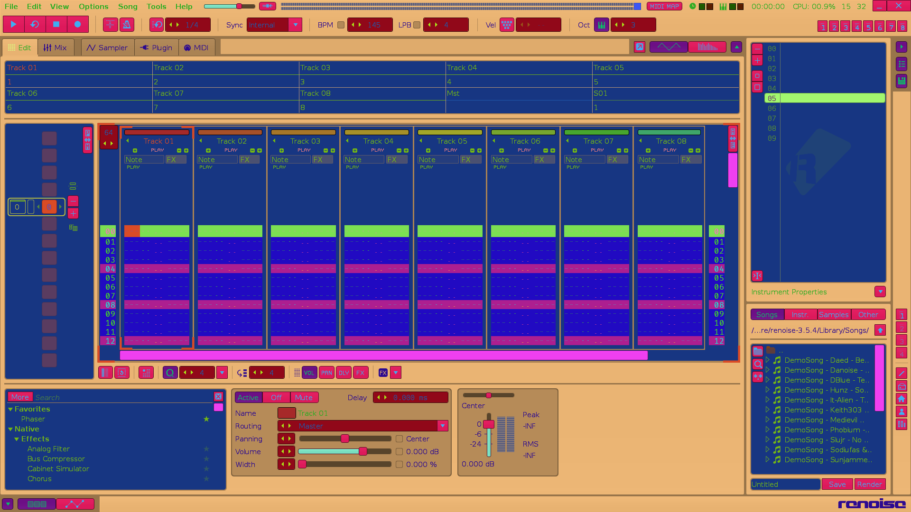

# Renoise Themes

A web platform for sharing, browsing, and previewing Renoise color themes. Upload a `.xrnc` file and the app automatically generates a color palette, applies the theme to live Renoise UI screenshots, and tags it by mood and color family.



---

## How It Works

### 1. Parsing the Theme

Renoise themes are XML files (`.xrnc`) where each element maps to a UI component — things like `Pattern_Main_Back`, `Mixer_Font`, `Button_Back`, and hundreds more.

The parser reads every color value in the file and assigns it a **semantic role** and **visual weight**:

| Role | Examples | Weight |
|------|----------|--------|
| `background` | Main backgrounds, pattern areas | High (4–10) |
| `text` | Fonts, labels | Medium (3–6) |
| `ui` | Buttons, sliders, borders | Low (1–3) |
| `accent` | Cursors, VU meters, selections | Lowest (1–2) |

Colors are deduplicated and sorted by weight so the most visually dominant ones rise to the top.

---

### 2. Auto-Tagging

Once colors are extracted, the categorizer converts everything to HSL and runs a **weighted analysis** — prominent colors influence the result more than background noise:

- **Brightness** → `dark`, `medium`, `light`
- **Saturation** → `monochrome`, `pastel`, `neon`
- **Temperature** → `warm`, `cool`, `mixed`
- **Color families** → `red`, `blue`, `green`, `purple`, etc. (top 2 by weight)
- **Contrast** → `high-contrast` if prominent colors span more than 60% lightness range

---

### 3. Palette Generation

The top colors are arranged into four tiers by weight and rendered as an SVG strip:

```
MAIN       ████████████████  (weight ≥ 8, tallest blocks)
SECONDARY  ████████████      (weight 4–8)
UI         ████████          (weight 2–4)
ACCENTS    ████              (weight < 2, smallest blocks)
```

---

### 4. Preview Screenshots

This is the most technically involved part. The goal is to show exactly how a theme looks inside Renoise without needing Renoise installed.

**How the pixel maps were built:**

1. The Default Renoise theme was loaded and each UI element was assigned a unique solid color
2. Screenshots were taken of three views: Pattern Editor, Mixer, and Waveform Editor
3. Every pixel in those screenshots was mapped back to its UI element name
4. The result was saved as binary index files (`.bin`) — flat arrays of `uint32` where each value points to an element name in a companion `.json` file

**How previews are rendered at upload time:**

1. Load the reference screenshot for each view
2. Load the pixel map (`.bin` + `.json`) for that view
3. For each pixel: look up which UI element it belongs to, find that element's color in the uploaded theme, and paint it
4. Pixels that don't map to any element (icons, text glyphs, etc.) are left untouched

The result is a pixel-accurate preview of the theme applied to a real Renoise interface.

```
reference screenshot
      +
pixel → element map       →   theme-colored preview PNG
      +
uploaded theme colors
```

---

## Stack

- **Backend:** Node.js, Express.js, EJS templates
- **Database:** SQLite via `better-sqlite3` (WAL mode, prepared statements)
- **Image rendering:** `@napi-rs/canvas`
- **XML parsing:** `fast-xml-parser`
- **File uploads:** Multer
- **Frontend:** Vanilla JS, localStorage for likes, PicoCSS

---

## Running Locally

```bash
npm install
npm run dev
# → http://localhost:3000
```

The SQLite database and upload directories are created automatically on first run.

---

## Roadmap

### Online Theme Creator

The next major feature is a fully browser-based theme editor — no Renoise required:

- **Live preview** — every color change reflected instantly across all three UI views (Pattern, Mixer, Waveform) using the same pixel map system that powers the current renderer, but running client-side via Canvas API
- **Color picker per role** — paint by semantic role (background, text, accent) and have the editor propagate the change to all matching elements automatically
- **Fine-grained control** — expand any role to tweak individual elements (e.g. set `Mixer_Font` separately from `Pattern_Font`)
- **Export to `.xrnc`** — generate a valid Renoise theme file ready to install
- **Fork existing themes** — load any uploaded theme as a starting point and remix it
- **Community sharing** — publish directly from the editor to the gallery
